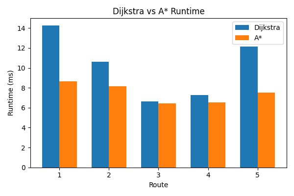
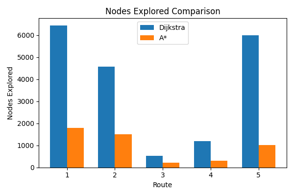
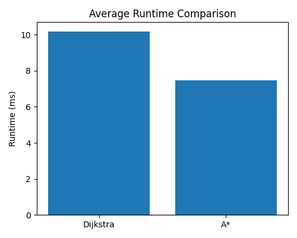

<div align="center">


<br/><br/>

# 🗺️ Route Planning Engine

### Shortest-path routing on real roads — not textbook graphs.

Built on **32,331 real intersections** from OpenStreetMap, Hauz Khas, New Delhi.  
Implements **Dijkstra** and **A\*** on a city-scale road network with interactive map output.

<br/>

[View Demo](#demo) · [How It Works](#how-it-works) · [Benchmark Results](#benchmark-results) · [Get Started](#getting-started)

</div>

---

<br/>

## 📌 Overview

Most algorithm courses teach Dijkstra and A\* on made-up graphs with 10 nodes.

This project runs them on the **actual road network of Hauz Khas, New Delhi** — 32,331 intersections, 17,372 road segments, real geographic coordinates. You give it a `latitude` and `longitude`. It snaps to the nearest intersection, computes the shortest path, and renders the route on a live interactive map.

<br/>

---

## 🗺️ Demo


> *Optimal route computed between two real locations in South Delhi — overlaid on a live OpenStreetMap layer using Folium.*

```bash
python visualization/visualize.py   # generate the map
open visualization/route.html       # view in browser
```

<br/>

---

## 📊 Dataset Statistics

| Metric | Value |
|:---|---:|
| Region | Hauz Khas, New Delhi |
| Total Nodes | 32,331 |
| Total Edges | 17,372 |
| Data Source | OpenStreetMap |
| Graph Type | Weighted Directed Graph |
| Edge Weights | Distance (km) · Travel Time (min) |

<br/>

---

## ✨ Highlights

| | |
|:---|:---|
| 🏗️ | Parsed and processed a real OSM XML file into a working road-network graph |
| 📍 | Geo-coordinate snapping — any lat/lon maps to the nearest road intersection |
| ⚡ | A\* reduced explored nodes by **~74%** vs Dijkstra on identical routes |
| 🗺️ | Routes exported as GeoJSON and rendered on interactive OpenStreetMap layers |
| 📈 | Full benchmarking framework with runtime and search-space metrics |
| 🔬 | Both algorithms produce provably optimal routes |

<br/>

---

## ⚙️ How It Works

```
  (lat, lon) input
        │
        ▼
  ┌─────────────────────┐
  │  Nearest Node Finder │  ← Haversine distance to all nodes → closest match
  └─────────────────────┘
        │
        ▼
  ┌─────────────────────┐
  │  Road Network Graph  │  ← 32K nodes · 17K edges · built from OSM XML
  └─────────────────────┘
        │
        ▼
  ┌─────────────────────┐
  │   Dijkstra / A*      │  ← Priority queue · edge relaxation · heuristic
  └─────────────────────┘
        │
        ▼
  ┌─────────────────────┐
  │ Route Reconstruction │  ← Parent pointer trace from destination → source
  └─────────────────────┘
        │
        ▼
  ┌─────────────────────┐
  │  GeoJSON → Folium    │  ← Interactive HTML map on OSM tiles
  └─────────────────────┘
```

Road intersections → **nodes** · Road segments → **edges** · Edge weights computed via the **Haversine formula** for geodesic accuracy.

<br/>

---

## 🧠 Algorithms

### Dijkstra's Algorithm
Explores the graph outward from the source, always relaxing the lowest-cost edge next. Guaranteed optimal. No sense of direction — explores uniformly in all directions.

```
Complexity:  O((V + E) log V)
Heuristic:   None
Strategy:    Uniform cost search
```

### A\* Search
Same as Dijkstra, but guided — uses straight-line geographic distance to the destination as a heuristic to prioritize nodes in the right direction. Explores far fewer nodes while still finding the optimal route.

```
Complexity:  O((V + E) log V)  — much faster in practice
Heuristic:   Haversine distance (current node → destination)
Strategy:    Best-first, goal-directed
```

<br/>

---

## 📈 Benchmark Results

Averaged over multiple randomly sampled source-destination pairs across the Hauz Khas network.

### Runtime Comparison


### Nodes Explored


### Average Runtime


<br/>

| Metric | Dijkstra | A\* | Improvement |
|:---|:---:|:---:|:---:|
| Average Runtime | 10.18 ms | 7.46 ms | ✅ **~27% faster** |
| Avg. Nodes Explored | 3,746 | 969 | ✅ **~74% fewer** |
| Route Optimality | ✅ Optimal | ✅ Optimal | — |

> **A\* explored 74% fewer nodes** while returning the exact same optimal route — a direct demonstration of how a well-chosen heuristic transforms algorithm performance on real data.

<br/>

---

## 🛠️ Tech Stack

| Layer | Technology |
|:---|:---|
| Core Engine | C++17 |
| XML Parsing | TinyXML2 |
| Distance Formula | Haversine |
| Visualization | Python · Folium · OSM Tiles |
| Route Export | GeoJSON |
| Build | g++ (manual) |

<br/>

---

## 📂 Project Structure

```
route-planning-engine/
│
├── data/                          ← OSM dataset (.osm XML file)
│
├── include/                       ← All header files
│   ├── Graph.h
│   ├── Node.h
│   ├── Edge.h
│   ├── Route.h
│   ├── Dijkstra.h
│   ├── AStar.h
│   ├── OSMParser.h
│   ├── NearestNodeFinder.h
│   └── RouteVisualizer.h
│
├── src/                           ← All source implementations
│   ├── Graph.cpp
│   ├── Utils.cpp
│   ├── Dijkstra.cpp
│   ├── AStar.cpp
│   ├── OSMParser.cpp
│   ├── NearestNodeFinder.cpp
│   └── RouteVisualizer.cpp
│
├── benchmark/                     ← Benchmark runner scripts
├── visualization/                 ← visualize.py + route.html output
│
├── screenshots/
│   ├── route_visualization.png    ← Route map (Demo section)
│   ├── runtime_comparison.png     ← Runtime chart
│   ├── nodes_comparison.png       ← Nodes explored chart
│   └── average_runtime.png        ← Avg runtime chart
│
├── external/
│   └── tinyxml2/                  ← Vendored XML parsing library
│
├── main.cpp                       ← Entry point
└── benchmark_results.csv          ← Raw benchmark output
```

<br/>

---

## 🚀 Getting Started

### Prerequisites

- `g++` with C++17 support
- Python 3.x
- Folium — `pip install folium`

### Build & Run

```bash
# 1. Clone the repo
git clone https://github.com/mohitm0311/route-planning-engine.git
cd route-planning-engine

# 2. Compile
g++ \
main.cpp \
src/Graph.cpp \
src/Utils.cpp \
src/Dijkstra.cpp \
src/AStar.cpp \
src/OSMParser.cpp \
src/RouteVisualizer.cpp \
src/NearestNodeFinder.cpp \
external/tinyxml2/tinyxml2.cpp \
-Iinclude \
-o route_engine

# 3. Run the engine
./route_engine

# 4. Generate & view the route map
pip install folium
python visualization/visualize.py
open visualization/route.html
```

<br/>

---

## 🏆 Project Outcomes

- Constructed a weighted directed graph from real OpenStreetMap XML data
- Implemented and compared two shortest-path algorithms on a 32K-node network
- Achieved **~74% reduction** in explored nodes using A\* over Dijkstra
- Exported computed routes as GeoJSON and visualized them on interactive maps
- Built a reusable benchmarking framework for routing algorithm comparison

<br/>

---

## 🔮 Future Enhancements

- [ ] Bidirectional Dijkstra / A\* for further speedup
- [ ] Turn-by-turn navigation output
- [ ] Alternative route generation
- [ ] Traffic-aware dynamic edge weights
- [ ] KD-Tree / R-Tree for faster nearest-node lookup
- [ ] Scale to full city or multi-city networks
- [ ] Multi-modal transport support

<br/>

---

<div align="center">

**Mohit Mehto**  
B.Tech Chemical Engineering · Indian Institute of Technology Delhi  
<br/>
⭐ Star this repo if you found it useful!

</div>